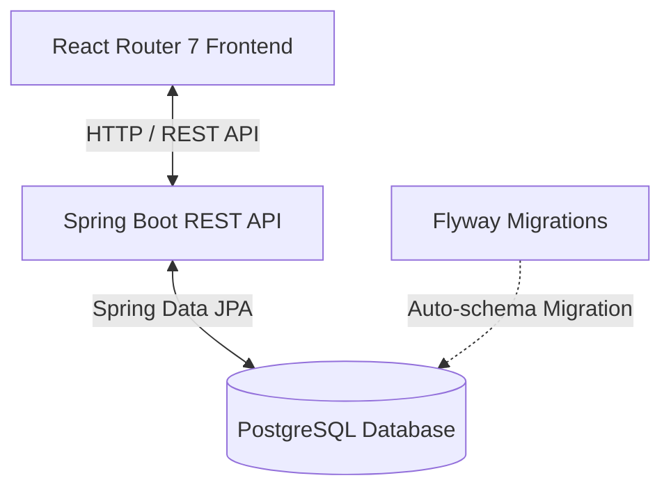
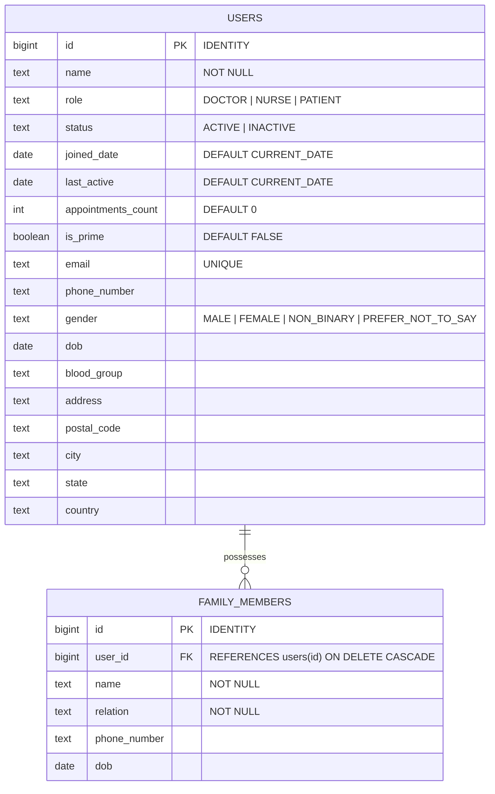

# Jiva Health — User Management Dashboard

A full-stack, responsive user management dashboard built for a digital health platform called **Jiva Health**. This project was initially designed as a technical take-home assignment and has been polished into a production-ready resume project.

It features a modern frontend built with **React Router v7**, **Tailwind CSS**, and **Shadcn UI**, paired with a robust backend powered by **Spring Boot (Java 21)**, **Spring Data JPA**, **PostgreSQL**, and **Flyway** for automated database migrations. The entire stack is containerized with **Docker** and orchestrated using **Docker Compose** for a seamless, single-command setup.

---

## 🚀 Architecture Overview

This project employs a clean separation of concerns, decoupling the user interface from the API and persistence layers:



### Key Technical Patterns
- **Monorepo Structure**: Independent `/client` and `/server` directories with unified multi-container orchestration.
- **DTO Pattern**: Decoupling database entities (`User`, `FamilyMember`) and API payloads using Java Records (`UserRequest`, `UserResponse`).
- **Relational Integrity**: Active relational mappings including a `One-to-Many` relationship between primary patients and their family members (linked via cascade-deleting foreign keys).
- **Zod Schema Validation**: Safe-parsing incoming backend responses on the client side, plus validation schemas on the React Hook Form UI.
- **Flyway Migrations**: Production-grade versioned SQL migrations (`V1__create_users.sql`, `V2__seed_initial_data.sql`) to configure tables and seed initial sample data.

---

## ✨ Features

- **💡 Metrics Panel**: Real-time summary metrics calculating:
  - Total users registered.
  - Distribution of Prime vs. Non-Prime users.
  - Total registered family members.
  - Average appointments count per user.
- **🔍 Advanced Search & Filter**:
  - Live fuzzy search across Name, Email, and Phone number.
  - Filter by Active/Inactive status.
  - Categorization filter by Gender and Age Groups.
- **📋 User Directory & Details**:
  - Listing user profiles with distinct roles (`DOCTOR` (Admin), `NURSE` (Support), `PATIENT` (Normal User)).
  - Upgrading status dynamically to Prime membership.
  - Viewing, editing, and mapping family member profiles (daughters, spouses, parents, siblings).
- **➕ Registration Form**: Intuitive modal form with robust field validations (e.g., specific international phone formats `+\d{11,13}`, email structure, past-date restraints).

---

## 🛠️ Technology Stack

### Frontend
- **Framework**: [React Router v7](https://reactrouter.com/) (formerly Remix, leveraging Vite for lightning-fast bundling)
- **Language**: TypeScript
- **Styling**: Tailwind CSS & [Shadcn UI](https://ui.shadcn.com/)
- **State & Form Handling**: React Hook Form, Zod (Validation), Lucide React (Icons)

### Backend
- **Framework**: [Spring Boot 4.x](https://spring.io/projects/spring-boot)
- **Language**: Java 21
- **ORM & Persistence**: Spring Data JPA / Hibernate
- **Database**: PostgreSQL 16
- **Migration Tool**: Flyway Migration
- **Boilerplate Reduction**: Lombok

### DevOps & Infrastructure
- **Containerization**: Docker (Multi-stage builds for client and server)
- **Orchestration**: Docker Compose

---

## 📁 Repository Structure

```
user-mgmt/
├── client/                     # React Router Frontend
│   ├── app/                    # Application source files
│   │   ├── components/         # Custom React elements (ui, userMgmt layouts)
│   │   │   └── userMgmt/       # Metric grids, filter bars, forms, list cards
│   │   ├── lib/                # API client utilities (api.ts)
│   │   └── routes/             # Client-side router endpoints (userMgmt dashboard, 404)
│   ├── public/                 # Static assets
│   ├── Dockerfile              # Multi-stage production container build config
│   ├── package.json            # Node dependencies and scripts
│   └── tsconfig.json           # TypeScript compilation config
│
├── server/                     # Spring Boot Backend
│   ├── src/main/java/jiva/     # Java Source code
│   │   └── user_mgmt/
│   │       ├── controller/     # REST controllers (UserController, FamilyMemberController)
│   │       ├── dto/            # Data Transfer Objects (records)
│   │       ├── entity/         # Database models (User, FamilyMember)
│   │       ├── enums/          # Status, Role, Gender, BloodGroup definitions
│   │       ├── repository/     # Spring Data JPA Repository interfaces
│   │       └── service/        # Core business operations
│   ├── src/main/resources/     # Resource bundle and configurations
│   │   ├── db/migration/       # Flyway schema versioning & seeds
│   │   └── application.properties # Application and dev settings
│   ├── Dockerfile              # JDK 21 / Maven container build file
│   └── pom.xml                 # Maven dependencies
│
└── docker-compose.yml          # Local orchestration for db, server, and client
```

---

## 🗄️ Database Schema



---

## 📡 API Reference

### 👤 User Endpoints

#### 1. Retrieve All Users (Summary View)
- **Endpoint**: `GET /api/users`
- **Response**: `200 OK` (Array of user overview metadata, excluding detailed address profiles for optimal performance).

#### 2. Retrieve Detailed User Profile
- **Endpoint**: `GET /api/users/{id}`
- **Response**: `200 OK` (Full JSON representation of a user, including detailed address mapping, blood groups, etc.).
- **Error Response**: `404 Not Found` (If user does not exist).

#### 3. Create User
- **Endpoint**: `POST /api/users`
- **Request Body**: `UserRequest` DTO
- **Response**: `201 Created` with a `Location` header pointing to `/api/users/{id}`.

### 👥 Family Member Endpoints

#### 1. Retrieve Total Family Members Count
- **Endpoint**: `GET /api/familyMembers/total`
- **Response**: `200 OK` (A numeric scalar count of all mapped family members in the database).

---

## 🚦 Getting Started

### Option A: Running with Docker Compose (Recommended)
Make sure you have [Docker](https://www.docker.com/) and [Docker Compose](https://docs.docker.com/compose/) installed on your machine.

1. Clone this repository and navigate to the root directory.
2. Spin up the entire environment (Postgres DB, Spring Boot Server, and React Frontend) with a single command:
   ```bash
   docker-compose up --build
   ```
3. Once the build completes:
   - The **Frontend Dashboard** is accessible at `http://localhost:5173`.
   - The **Backend API** is running at `http://localhost:8080`.
   - The **PostgreSQL Database** container exposes port `5432` locally.

---

### Option B: Local Manual Setup (Development Mode)

If you prefer running the components directly on your system:

#### 1. PostgreSQL Database Setup
1. Install PostgreSQL and create a database named `jiva`:
   ```sql
   CREATE DATABASE jiva;
   ```
2. By default, the backend connects using the credentials defined in `server/src/main/resources/application-dev.properties` (User: `deepak`, Password: `[blank]`, Port: `5432`). Adjust these parameters to match your database settings.

#### 2. Running the Spring Boot Backend
1. Ensure you have **Java 21** and **Maven** installed.
2. Navigate to the server folder:
   ```bash
   cd server
   ```
3. Run the application with the development profile:
   ```bash
   ./mvnw spring-boot:run -Dspring-boot.run.profiles=dev
   ```
4. Verify the backend is up and running by opening `http://localhost:8080/api/users` in your browser.

#### 3. Running the React Router Frontend
1. Ensure you have **Node.js v20+** installed.
2. Navigate to the client folder:
   ```bash
   cd client
   ```
3. Install the packages:
   ```bash
   npm install
   ```
4. Create or verify the environment configuration file `.env` (it should contain the base endpoint of your backend):
   ```env
   VITE_API_BASE_URL=http://localhost:8080/api
   ```
5. Start the development server:
   ```bash
   npm run dev
   ```
6. Open your browser and navigate to `http://localhost:5173`.
